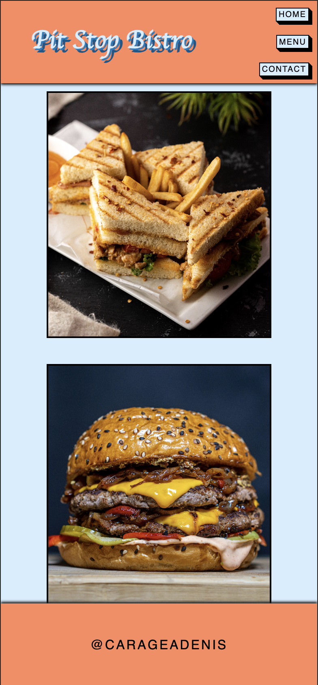

#restaurant

	<h1>Restaurant Page Project
	 
		
		
		
		 
	</h1>
	<h3><b><a href="https://carageadenis1806.github.io/restaurant_page/">View Live Demo</a></b></h3>

## Description

This is a book library app created as part of [TheOdinProject](https://www.theodinproject.com) curriculum.

To see the assignment details - [Click Here](https://www.theodinproject.com/lessons/node-path-javascript-restaurant-page)

## Built Using

-   HTML5 
-   CSS3 
-   JavaScript 
-   Webpack

## Gallery

#### Home Page

#### Mobile View

